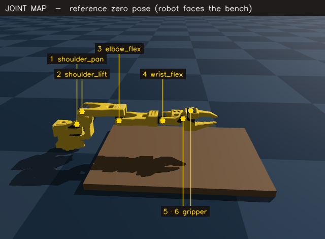
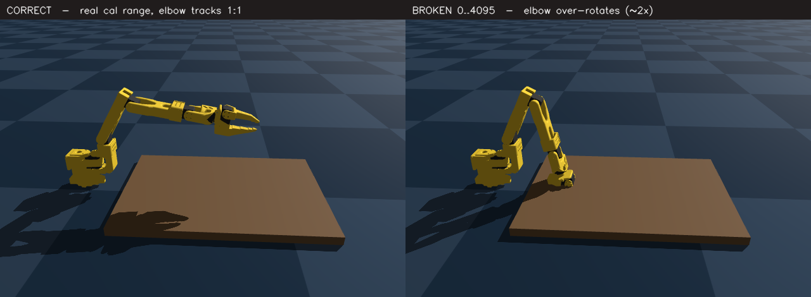
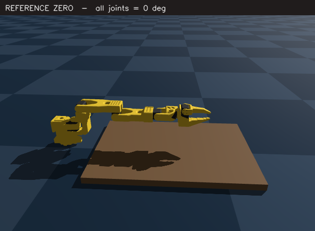
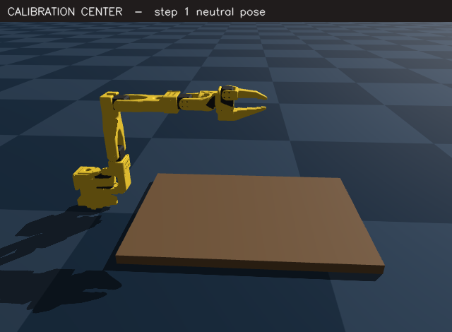
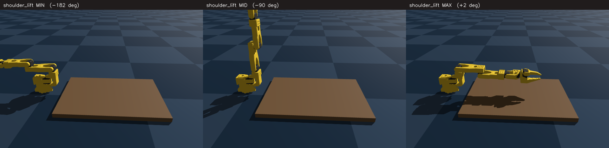
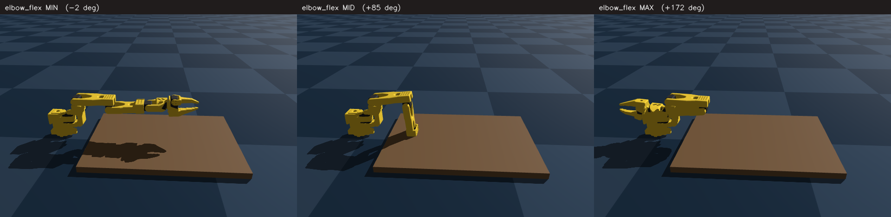
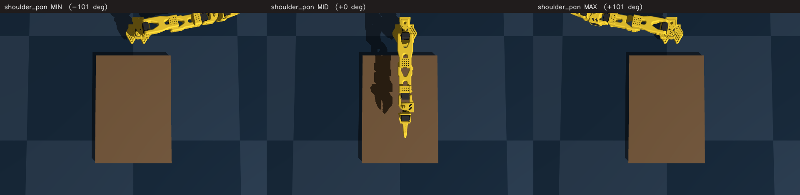
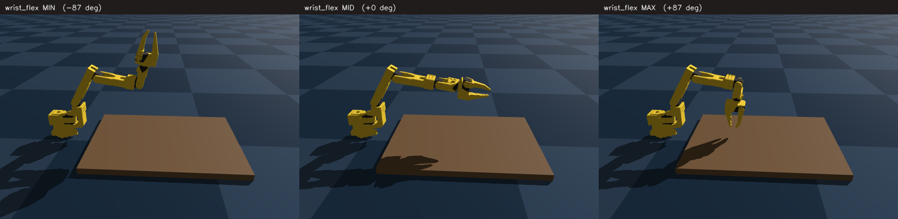
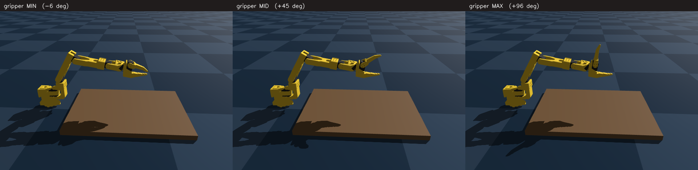
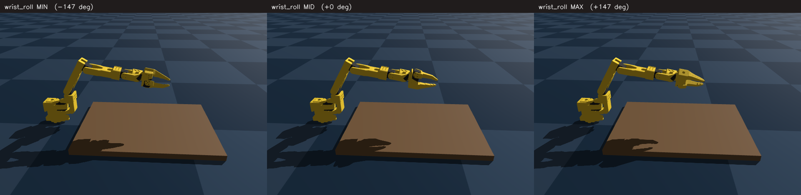

# Aligning the Physical Leader Arm with the Genesis Simulator

This guide walks you through bringing the **physical SO-101 leader arm** into a
state where the **Genesis simulator tracks it correctly** — at rest and through
its full range of motion. No eyeballed angles, no random tweaks: the sim is
derived from your hardware once the leader is calibrated properly.

---

## 1. The mental model

The simulator never "decides" a pose. For every joint it computes:

```
sim_angle = map( encoder_count )
```

- `encoder_count` is the raw servo reading (`Present_Position`, 0–4095).
- `map(...)` converts that count into a URDF joint angle.

So if the **mapping inputs are correct**, the sim *must* match the physical arm.
There is nothing to hand-tune. The whole problem reduces to: **give the mapping
correct inputs.**

### The six joints

These are the joints you'll move during calibration, base to gripper:



| # | Joint           | Motion                                  |
| - | --------------- | --------------------------------------- |
| 1 | shoulder_pan    | base rotates left/right (yaw)           |
| 2 | shoulder_lift   | base pitches the arm up/down            |
| 3 | elbow_flex      | elbow opens/folds                       |
| 4 | wrist_flex      | wrist pitches up/down                   |
| 5 | wrist_roll      | gripper rotates about the forearm axis  |
| 6 | gripper         | jaws open/close                         |

---

## 2. Why it was never matching (root cause)

The calibration-based mapping needs each joint's true travel range
(`range_min..range_max`) from the LeRobot calibration file:

```
~/.cache/huggingface/lerobot/calibration/teleoperators/so_leader/sarm101_leader.json
```

Two joints were saved with a **bogus full-span range**, meaning they were never
actually moved through their real travel during calibration:

| Joint           | Saved range   | Status                                  |
| --------------- | ------------- | --------------------------------------- |
| shoulder_pan    | `1105..3581`  | OK                                      |
| **shoulder_lift** | **`0..4095`** | **BROKEN — never swept**                |
| **elbow_flex**    | **`0..4095`** | **BROKEN — never swept**                |
| wrist_flex      | `342..2642`   | OK                                      |
| wrist_roll      | `0..4095`     | OK (this joint genuinely spins freely)  |
| gripper         | `2037..3004`  | OK                                      |

With a fake `0..4095` span, the mapping scales those two joints by roughly 2×
the real amount — which is the "fluctuating", "never lines up" behavior. Same
encoder reading, two very different sim poses:



The fix is to **re-calibrate and actually sweep those joints**, so their ranges
become real.

---

## 3. The reference frame (what "zero" means)

Every joint angle is measured from the URDF **zero** pose. You never have to set
the arm to this pose by hand — it's just the coordinate frame the numbers are
measured against. For intuition, this is what all-zeros looks like (arm fully
extended, gripper forward):



---

## 4. Re-calibrate the leader (the one thing you do by hand)

Run:

```bash
uv run sarm-hand calibrate --role leader --port /dev/tty.usbmodem5B140289771
```

Torque is off during calibration — you move the arm by hand.

### Step 1 — Center pose

Move **all** joints to a comfortable neutral mid pose and press **Enter**. This
records each joint's encoder center. Something like this is ideal (nothing
against a hard stop):



### Step 2 — Sweep the full range (THIS is the make-or-break step)

Move each joint **slowly through its entire mechanical travel**, one at a time,
while watching the live MIN / MAX table. **Do not press Enter** until every
joint — especially `shoulder_lift` and `elbow_flex` — shows a **real span**.

> If `shoulder_lift` or `elbow_flex` still read `0..4095`, they were not swept.
> Move them end-to-end again before continuing. Move slowly so a dropped USB
> packet does not abort the step.

`shoulder_lift` must travel from one extreme to the other:



`elbow_flex` must travel from fully open to fully folded:



For reference, here is the full travel of the remaining joints. Match each one
end-to-end while watching its MIN/MAX update:

`shoulder_pan` (viewed from above — rotates the whole arm left/right):



`wrist_flex` (pitches the gripper up/down):



`gripper` (jaws open/close):



### Step 3 — wrist_roll

Leave `wrist_roll` alone in step 2. It spins continuously, so `0..4095` is
correct for it — its neutral comes from the step-1 center only. (For reference,
this is the rotation it provides:)



### Verify the saved ranges

```bash
uv run sarm-hand config-show          # or inspect the JSON directly
cat ~/.cache/huggingface/lerobot/calibration/teleoperators/so_leader/sarm101_leader.json
```

Confirm **no `0..4095`** on `shoulder_lift` or `elbow_flex`. If they're real
spans, calibration succeeded.

---

## 5. Switch the sim to the calibrated mapping

Once the ranges are real, the calibration-based mapping is exact and needs **no
eyeballed offsets**. In `config/default.yaml`:

```yaml
genesis:
  urdf: assets/robots/so101/so101_old_calib.urdf
  mapping: legacy        # was: delta — legacy maps real cal range -> URDF range
```

> Tell me when your re-calibration is saved and I'll flip this and validate it
> for you, rather than you editing it by hand.

---

## 6. Verify the match live

```bash
uv run sarm-hand calibrate-genesis --leader-port /dev/tty.usbmodem5B140289771
```

What to check in the live table:

- **`m−s` ≈ 0** for every joint — the sim is tracking the commanded mapping.
- Move the leader: the sim should move the **same direction and amount**.
- At your physical rest pose, the sim should sit in the matching rest pose.

### If a joint moves the wrong way

Flip that joint's sign in `config/default.yaml`:

```yaml
genesis:
  joints:
    elbow_flex: { sign: -1 }   # flip +1 <-> -1
```

### If a joint is offset by a constant angle

The live table prints a suggested `frame_offset` for that joint — apply it under
`genesis.joints.<joint>.frame_offset`.

---

## 7. Quick reference

| Goal                         | Command                                                                        |
| ---------------------------- | ------------------------------------------------------------------------------ |
| Re-calibrate leader          | `uv run sarm-hand calibrate --role leader --port <leader-port>`               |
| Inspect calibration JSON     | `cat ~/.cache/huggingface/lerobot/.../so_leader/sarm101_leader.json`           |
| Live leader ↔ sim check      | `uv run sarm-hand calibrate-genesis --leader-port <leader-port>`              |
| Record in sim (leader)       | `uv run sarm-hand record-sim --leader`                                         |

**Golden rule:** never hand-edit angles to "make it look right." If the sim is
wrong, the mapping inputs (calibration ranges, sign, frame_offset) are wrong —
fix those, and the match follows.
